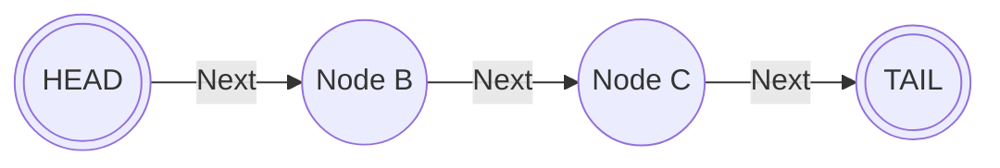
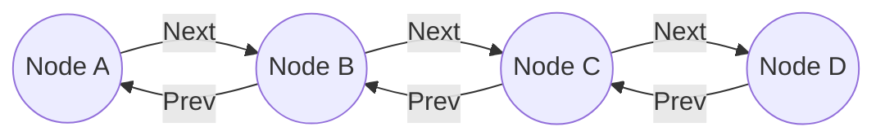
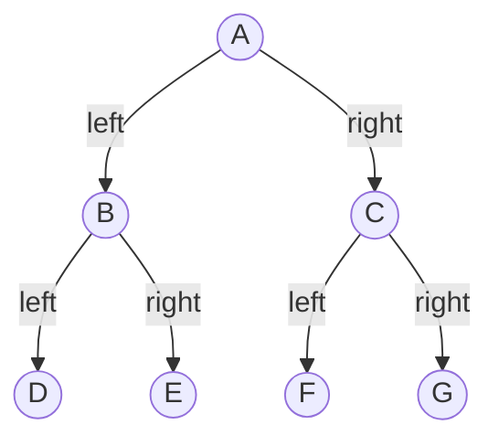

# Using Python and its data structres in VFX pipeline context

## Basics
- Create Node:
-- Use it for **Singly Linked List**

-- Use it for **Doubly Liked List**

- Create TreeNode:
-- Use it for a **Binary Tree**

