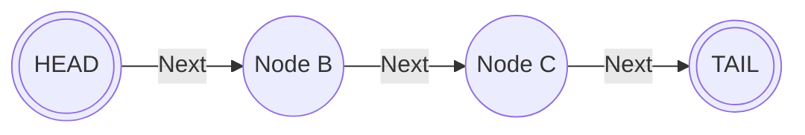
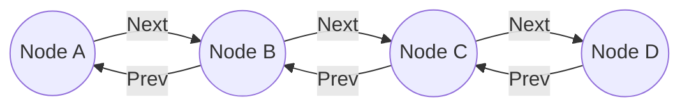
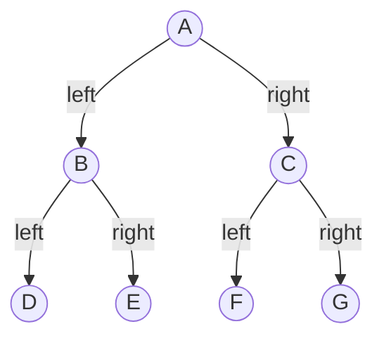

# Using Python and its data structres in VFX pipeline context

## Basics
**1. Create Node:**
-- Use it for **Singly Linked List**.
-- Create methods to append, reverse and print the list.

-- Use it for **Doubly Liked List**.
-- Create methods to append, reverse and print the list.

**2. Create TreeNode:**
-- Use it for a **Binary Tree**
-- Create methods to append, print and ( **place holder** )

